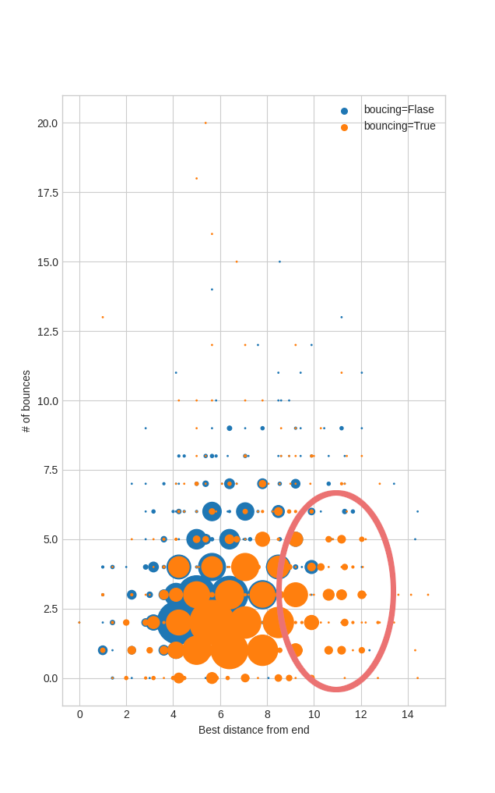

# Olgierd Kasprowicz - projekt I

## Wybrany problem
c) Labirynt

## Przetestowane algorytmy
- główny algorytm genetyczny
- j.w. z modyfikacją "bouncing"
- flood fill

### Główny algorytm genetyczny

z użyciem PyEasyGa. Jest to rozwinięty pomysł opisany podczas zajęć - mianowicie:
- chromosom to ruchy=40 * 2 bitów (=80)

```
# we'll trick PyEasyGA into getting 2 bits per move chromosome
data = [None] * (40 * 2)
```

- parami bity chromosomu dekodowane są w ruchy - wektory przesunięć
- funkcja fitness "przechodzi" labirynt, zlicza dystans od końca w każdym kroku, następnie zwraca posortowny wektor dystansów. Jeżeli ruch kończy się w przeszkodzie lub wypada poza granice labiryntu to jest ignorowany (tzn. zostaje on zliczony na boku, natomiast algorytm leci dalej tak, jakby ten ruch nigdy się nie odbył. Moim zdaniem jest to lepsze rozwiązanie niż zwracanie pojedynczej wartości, ponieważ może nastąpić optymalizacja pod krążenie wokół punktów będących blisko końca i w rezultacie wychodzenie z zakamarków.
- parametry zostały dobrane tak, aby algorytm liczył się w miarę szybko (~1s) na labiryncie 20x20. Zdecydowałem się na więcej generacji (=100), niż populacji początkowej(=50), ponieważ moim zdaniem ważniejsze jest optymalizowanie ścieżki, niż startowanie z dużą ilością potencjalnych rozwiązań. Natomiast zbyt mała populacja mogłaby prowadzić do zbyt szybkiej konwergencji na rozwiązaniu suboptymalnym (przy krzyżowaniu mogłoby wychodzić podobne nowe ścieżki)

#### Kod
```python
def fitness(self, individual, _):
    moves = decode_moves(individual)

    p = self.l.start
    x2, y2 = self.l.end
    distances = []
    bounces = 0

    for m in moves:
        _p = (p[0] + m[0], p[1] + m[1])

        try:
            if not self.l[_p]:
                bounces += 1
                continue
        except ValueError:
            bounces += 1
            continue

        p = _p

        x1, y1 = p
        d = ((((x2 - x1 ) ** 2) + ((y2 -y1) ** 2) ) **0.5)
        distances.append(d)

    sorted_distances = sorted(distances)

    self.debug["bounces"] = bounces

    if self.bouncing_strategy:
        ...  # tak, to jest celowe
    else:
        return sorted_distances
```

### Modyfikacja "bouncing"

Jest to hipoteza, że jeżeli funkcja fintess będzie optymalizować również pod odbicia to możliwe będzie bardziej efektywne wykorzystanie dostępnych ruchów aby znaleźć rozwiązanie. Modyfikację tę wprowadzam dodając liczbę odbić od ścian do zwracanej krotki, następująco:

```
return (sorted_distances[0], bounces, sorted_distances[1:])
```

#### Eksperyment

Zaprojektowałem eksperyment służący weryfikacji tej hipotezy - na 1 ustalonym labiryncie 20x20 wykonam 1000 iteracji algorytmu z modyfikacją "bouncing" oraz bez. Suma odległości per próbka powinne dać jakąś informację na temat skuteczności tej modyfikacji. Ziarno losowości zostało ustalone apriori, aby eksperyment był powtarzalny. Niestety ze względu na ogrniczenie z jednej strony dostępną mocą obliczeniową (pomimo zrównoleglenia!), z drugiej moją cierpliwością eksperyment uwzględniony jest tylko 1 labirynt. Może to prowadzić do sytuacji, w której modyfikacja jest lepsza dla tego jednego labiryntu (lub pewnej klasy labiryntów) a dla reszty gorsza. Życie.

| bouncing | wartość parametru  (mniej -> lepiej) |
|:--------:|:------------------------------------:|
|    nie   |           1.557260967605997          |
|    tak   |           1.668121090576592          |



Na wykresie wyraźnie widoczny jest (bo zaznaczyłem) klaster rozwiązań ewidentnie subooptymalnych, unkikalnych dla modyfikacji "bouncing", co może wyjasniać różnice w otrzymanych wynikach (tj. że modyfikacja bouncing wypada średnio ~5% gorzej od pierwotnego algorytmu).

**Konkluzja**: Eksperyment nie potwierdził hipotezy oraz wynik nie jest znacząco gorszy od pierwowzoru, w związku z tym temat jest otwarty do dalszej dyskusji. Możliwe, że modyfikacja ma sens przy odpowiednio większych parametrach populacji, pokoleń lub wielkości chromosomu.

### Flood fill

Jako algorytm porównawczy wybrałem [flood fill](https://en.wikipedia.org/wiki/Flood_fill) gdzie zamiast koloru wypełniam pola kolejnymi numerami uzyskując w ten sposób algorytm oznaczający każde pole długością najkrótszej ścieżki do tego pola. W związku z tym wystarczy pobrać wartość pola końcowego i wyznaczyć rozwiązanie problemu przez porównanie tej wartości z maksymalną liczbą kroków.

Algorytm jest zabójczo szybki, tej samej złożoności co Dijkstra, natomiast nie potrzeba modelować pól jako wierzchołków grafu (co oszczędza kod, jak i czas).

Implementacja nie używa dodatkowych bibliotek.

```python
def solve_flood_fill(l: Labyrinth) -> Optional[int]:
    q = [(l.start, 0)]
    visited = set()
    t = defaultdict(None)

    while q:
        item = q.pop() 
        point, _n = item
        x, y = point
        n = _n + 1

        try:
            reachable = l[point]
        except ValueError:
            pass
        else:
            if point not in visited and reachable:
                q = [(p, n) for p in [(x + 1, y), (x - 1, y), (x, y + 1), (x, y - 1)]] + q
                t[point] = _n
        finally:    
            visited.add(point)

    return t[l.end]
```

## Nieprzetestowane algorytmy
- ponieważ możliwych ścieżek populacyjnych jest 4^40 (4 możliwe ruchy, 40 możliwych slotów na ruchy), obawiam się, że w tym kształcie bym się nie doczekał policzenia rozwiązania, zwłaszcza, że nie jest ono zależne od rozmiaru labiryntu. Jest to bardzo reprezentatywny przykład, że złożoność stała to nie zawsze dobrze.

## Wybór inputów

Labirynty są generowane przeze mnie w pliku `labirynth.py`. Uważam, że jest to zacny kawałek kodu. Na szczególną uwagę zasługuje modelowanie domenowe - co świetnie pokazuje ten fragment kodu będący zapisem koncepcji "na polu startowym nie może znajdować się przeszkoda" - ```assert self[self.start] is Field.Reachable```. Interfejs programistyczny pozwala na sterowanie rozmiarami labiryntu, procentem wypełnienia przeszkodami oraz ziarnem losowości (domyślnie ustalonym na stałe, aby zapewnić reprodukowalność testów i eksperymentów).

Przeszkody dodawane są losowo.

Ponadto gotowy labirynt można również edytować manualnie z poziomu kodu, np.:
```
l = make_labyrinth(20,20, obstacle_fill_percent=20)
l.obstacles.remove((0, 1))
l.obstacles.remove((11, 7))
```
w powyższym listingu usuwam 2 przeszkody, aby labirynt był rozwiązywalny. Analogicznie odwrotnie można przeszkody dodawać.

Ponadto każdy labirynt można łatwo wyświetlić
```
>>> print(l)

    +123456789+123456789 
   ######################
+  #      oo   o  o   o #
1  #oo       o     o o o#
2  #o   o        oo     #
3  # o              oo  #
4  #ooo      o    oo    #
5  #     o      oo  o  o#
6  # o o   o         oo #
7  #    o  oo o o o     #
8  #  o o        o o  o #
9  #o o  o         o    #
+  #     o   o  oo      #
1  #     o    o         #
2  #    o               #
3  #                    #
4  #o           o     o #
5  #o o     o   o   oo  #
6  #                  o #
7  # oo             o   #
8  # o       o          #
9  #       o            #
   ######################
```

## Porównanie
| (x:y, wypełnienie) | 5:5, 15% | 5:5, 30% | 10:10, 20% | 20:20, 20% + poprawki manualne |
|:------------------:|:--------:|:--------:|:----------:|:------------------------------:|
|     flood fill     |  0.0003  |  0.0001  |   0.0004   |              0.001             |
|       genetyk      |    0.9   |    0.8   |     0.8    |               0.9              |

w ostatnim przypadku genetyk nie znalazł optymalnego rozwiązania

### Wnioski
- empirycznie zostaje potwierdzona hipoteza o niezależności czasu działania algorytmu od wielkości labiryntu
- moim zdaniem algorytmy genetyczne nie nadają się szczególnie do rozwiązywania problemów klasy labiryntu
