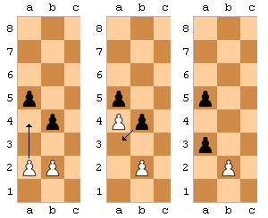

# Szachy

## Problem
Symulowanie parti szachowej ze znanymi arcymistrzami. Inspiracja: "Szkoda, że Morphy i Capablanca nie mieli okazji nigdy zagrać ze sobą".

### Dygresja - style arcymistrzów
Mikhail **Tal** vs Tigran **Petrosian**  [URS blitz 1975]


## Demonstracja

Jest niemożliwa, głównie dlatego, że dataset zawiera gry arcymistrzów z arcymistrzami. A do arcymistrza jeszcze **trochę** mi brakuje :)

## Model

### Bezpośredni

Jest niemożliwy, ponieważ:
- poprawne ruchy zmieniają się z tury na turę (czyli np. w turze n może być 15 możliwych ruchów, a w turze n - 4 (ponieważ król jest pod szachem, otoczony figurami).
- i to jest [znany problem](https://towardsdatascience.com/creating-a-chess-ai-using-deep-learning-d5278ea7dcf)
- rozmiary datasetu mogłbyby być problematyczne (dataset referencyjny z artykułu ma 20k **gier**), mój jest dataset zawiera ~80k **pozycji**, czyli ~10x mniej.

### Pośredni


#### Definicje

|     Rodzaj     |                                      Opis                                     |
|:--------------:|:-----------------------------------------------------------------------------:|
| Najlepszy ruch |         Wskazany przez silnik z ustawieniami skill_level=20, depth=18         |
|  Stylowy ruch  |   Pozycja gorsza od najelpszej o więcej niż 5 centypionów, ale mniej, niż 30  |
|     Blunder    | W rozumieniu arcymistrzowskim - pozycja gorsza o >= 3 dekapiony od najlepszej |

Notka: [klasyfikacja ruchów](https://www.chess.com/forum/view/game-analysis/good-move-vs-excellent-move)

#### Dygresja
- silniki w dalszym ciągu mają swoje słabe strony
- [Levy Rozman: jak wygrać z oszustem?](https://www.youtube.com/watch?v=l5MD6hn5PgI)
- [obrona Hipopotamowa](https://en.wikipedia.org/wiki/Hippopotamus_Defence)

## Ocena modelu

Wariacja [testu turinga](https://en.wikipedia.org/wiki/Turing_test) przeprowadzona na >= [100](http://www.tools4dev.org/resources/how-to-choose-a-sample-size/) arcymistrzach

## Przygotowania
- 2110 gier Garry'ego Kaspraova - dataset dostępny jako 1 plik `.pgn`
- [Stockfish](https://stockfishchess.org/) - silnik szachowy
- [stockfish.py](https://github.com/zhelyabuzhsky/stockfish) - driver Pythonowy
- [python-chess](https://python-chess.readthedocs.io/en/latest/) - biblioteka do pracy z szachami

### Kodownanie pozycji

### Dygresja



Notka: [roszada Pama-Krabbégo](https://pl.wikipedia.org/wiki/Roszada_Pama-Krabb%C3%A9go), niestety nieuznawana przez FIDE

### FEN
- Forsyth–Edwards Notation
```
rnbqkbnr/pppppppp/8/8/8/8/PPPPPPPP/RNBQKBNR w KQkq - 0 1
# pozycje/figur/na/planszy $kto_gra_teraz $roszady $enpassant $półlicznik $tura
```

## Weryfikacja hipotezy kształtu modelu

### Wstępne wnioski
- dla jednej gry (Anand v. Kasparov, Saint Louis Rapid 2017) dokładność wynosi 58-66%.
- Stockfish ma komponent niedeterministyczny (prawdopodobnie związany z używaną wewnętrznie hashtabelą)

### Subhipoteza najlepszego wielowyboru
Przykład
```
suboptimal move 11 2rqkbnr/1p3pp1/p2pb2p/4p3/4P3/2NQN3/PPP2PPP/R1B1K2R b KQk - 5 11 g8f6 f8e7
# ... $zagrany_ruch $najlepszy_ruch
```
ale:
```
info depth 18 seldepth 25 multipv 1 score cp *0* [...] d8c7 [...]
info depth 18 seldepth 22 multipv 2 score cp *0* [...] *g8f6* [...]
info depth 18 seldepth 27 multipv 3 score cp *0* [...] _f8e7_ [...]
```

#### Czas na hackowanko :D
- sterownik Stockfisha wspierał wielościeżki, ale bez zwracania ich wartości
- [Universal Chess Interface](https://en.wikipedia.org/wiki/Universal_Chess_Interface)


#### Dostosowywanie tolerancji
- 3 wielościeżki (poparte doświadczeniem)

| Tolerancja | % najlepszych ruchów |
|:----------:|:--------------------:|
|     3cp    |         73.3%        |
|     8cp    |         73.3%        |
|    20cp    |         76.6%        |
|    100cp   |          80%         |


- wybrałem **5cp**

#### Inne
- rezultaty są dosyć stabilne - na 3 podejścia, dla 6ciu ruchów tylko 1 propozycja była idiosynkratyczna dla podejścia
- głębokość=25 zamiast =18 wpływa tylko na czas liczenia
- Chess.com podaje dokładność arcymistrzów jako ~98%, natomiast [jest to zupełnie inna miara](https://support.chess.com/article/1135-what-is-accuracy-in-analysis-how-is-it-measured)

#### Generalizacja
- Dla większej ilości gier (23) hipoteza również się sprawdza

## Dataset
- konwersja `.pgn` -> lista FENów; nic ekscytującego
- rozmiar danych zwiększył się ~60x
- musiałem ręcznie naprawić błąd kodowania

## Anotowanie

```python
def compute_annotation(f):
    fname = f.replace("positions/", "annotations/")

    # !!!
    if os.path.isfile(fname):
        return

    ...

if __name__ == "__main__":
    batches = list(chunks(manifest, 100))
    total = len(batches)    
    with Pool(initializer=init_worker, initargs=(compute_annotation,)) as p:
        for i, b in enumerate(batches):
            p.map(compute_annotation, b)
            print("batch {} out of {} - {:.2f}% done!".format(i, total, i / total * 100))
```

### Offload do chmury
- na moim komputerze liczyło się za wolno + by mi buczał całą noc


- anotowanie trwało ~20h
- dostarczenie danych i kodu przez `scp`
- kontrola nad procesem przez `screen`
- zestawienie środowiska to `apt update; apt install -y screen stockfish python3`, więc nie było potrzeby automatyzacji

## Kodowanie
wejście:
```
   move_number                                                fen  move  is_best  is_white
0           11  r2q1rk1/1b2bppp/p2p1n2/npp1p3/4P3/P2P1N1P/BPP2...  b1c3        0         1
1           20  r2r2k1/1p2qp1p/pnp3pb/3p4/PP1P4/4P3/2QNNPPP/1R...  e7e6        0         0
2           11  r1bqk2r/1p2bppp/p4n2/n1pN4/P7/4PN2/BP3PPP/R1BQ...  c8e6        1         0
3           20  rn2r1k1/ppq1bpp1/4p2p/8/2N5/3QP3/PP2BPPP/3R1RK...  e2f3        0         1
4           35  3r2k1/1p1r2p1/5q2/Q2n3p/P2p4/1P1N4/5RPP/4R1K1 ...  f6d6        1         0
```

wyjście:
```
   is_best        a1        b1        c1  ...  f8        g8        h8
0      0.0  0.203684  0.339474  0.447368  ...  0.500000  0.796316  0.748158 
1      0.0  0.500000  0.796316  1.000000  ...  0.500000  0.500000  0.251842 
2      1.0  0.796316  0.500000  0.500000  ...  0.251842  0.500000  0.500000 
3      0.0  0.500000  0.500000  0.500000  ...  0.796316  0.500000  0.748158 
4      1.0  0.500000  0.500000  0.500000  ...  0.500000  0.500000  0.251842 
```

- przypisanie figurom wartości numerycznych
```
# https://en.wikipedia.org/wiki/Chess_piece_relative_value#Alternative_valuations - using AlphaZero system
PIECE_TO_NUMBER = {
    'p' : 1,
    'n' : 3.05,
    'b' : 3.33,
    'r' : 5.63,
    'q' : 9.5,
    'k' : (3.05 + 3.33 / 2), # interpolating Gik's valuation, I have to put something here...
} 
```
- normalizacja
```
def normalize_piece_encoding(x):
    return (x + 9.5) / 19
```
- **pilnowanie, żeby interesujący nas gracz miał ten sam znak niezależnie od rozgrywanego koloru**
- en passant oraz roszada zaplanowane na dalsze etapy


## ML
- przepuszczenie danych przez kilka prostych klasyfikatorów
- wstępnie ~67% dokładności przy k-NN (n=11) na 1/40 datasetu
- wyniki się nie zmieniają przy użyciu pełnego datasetu => **coś nie pykło!**

### Kim jesteśmy i czym jest accuracy?
- dodanie metryki dokładności rozkładu
- ```avg_diff_accuracy = 1 - abs(distribution - avg * 1)```
- ostateczne accuracy jest iloczynem zwykłej dokładności i odchyłu od porządanego rozkładu

### Wpadki
- ```c_avg = (tp + fp) / sum(c.ravel())``` vs ```c_avg = tp + fp / sum(c.ravel())```
- kodowanie pionka jako -1
- **nieprzekazywanie danych wzdłuż rurociągu**

### Wyniki


## Sieci neuronowe

### PyTorch
- Coś między "gołym" TF, a Kerasem - bardzo ciekawe podejście
- działa pod Nixem :D

### Architektura
```python
nn.Linear(64, 64),
F.relu,
# autoencoder
nn.Linear(64, 256),
nn.Linear(256, 64),
F.relu,
nn.Linear(64, 32),
F.relu,
nn.Linear(32, 16),
F.relu,
nn.Linear(16, 16),
F.relu,
nn.Linear(16, 2),
partial(F.log_softmax, dim=1),
```

### Wyniki
```
acc: 0.7083333333333334
distribution: 1.0
avg_diff accuracy: 0.682
total 0.4830833333333334
```

### Wpadki
- nie od razu się połapałem, że moja sieć zwraca zawsze "1"
- to:
```python
lst = []
for i in output:
    zeros, ones = i
    lst.append((0, ones.item() * 2))

t = torch.tensor(lst)
output = output + t
```
oczywiście nie wyszło:
```
acc: 0.4025
distribution: 0.1875
avg_diff accuracy: 0.5055
total 0.20346375
```

## Poprawka Gliwki-Lewandowskiego
- klasy nie były równo reprezentowane (stosunek ~2:1), błąd mógł ulegać zwielokrotnieniu podczas batchowania

### Rozwiązanie
- zwiększnie rozmiaru batchy do BS=1000
- zapewnienie klasom równoważnej reprezentacji
```python
labels = np.array(list(map(lambda i: dataset[i][1].item(), train.indices)))
labels = labels.astype(int)

c = Counter(labels.tolist())
majority_class_count, minority_class_count = c[1], c[0]

majority_weight = 1/majority_class_count
minority_weight = 1/minority_class_count
sample_weights = np.array([minority_weight, majority_weight])
weights = sample_weights[labels]
sampler = data_utils.WeightedRandomSampler(weights=weights, num_samples=len(train), replacement=True)

train_loader = data_utils.DataLoader(dataset=train, batch_size=BS, sampler=sampler)
```

### Wyniki


- Niestety najlepsze rezultaty nie były stabline -> sieć przy kolejnym przetrenowaniu potrafiła zwracać zupełnie inne wyniki
- ponadto nie jestem do końca pewien czy zapisane parametry są dokładne
- pojawia się tendencja w kierunku nadreprezentacji klasy "0"

## Ustabilizowanie wyniku
Przy najelpiej rokujących parametrach (DS=1/40; BS=1000; lr=5e-3) i epokach EPOCHS=1000:

```
acc: 0.7071428571428572
distribution: 0.5357142857142857
avg_diff accuracy: 0.8537142857142856
total 0.6036979591836734
fp 230 (16.43%), fn 180 (12.86%)
----
acc: 0.565
distribution: 0.6033333333333334
avg_diff accuracy: 0.9213333333333333
total 0.5205533333333333
fp 106 (17.67%), fn 155 (25.83%)
```

Pojawiają się przesłanki za overfittingiem, aczkolwiek rezultaty są stabilne (kolejne przetrenowanie sieci zwraca podobne wyniki)

## Generalizacja
Niestety przy użyciu pełnego datasetu i EPOCHS=100 następuje nadreprezentacja klasy "0"

```
acc: 0.5761570476751872
distribution: 0.298144079452691
avg_diff accuracy: 0.6225413986484498
total 0.3586816143008726
fp 6347 (11.34%), fn 17381 (31.05%)
----
acc: 0.5091068228233234
distribution: 0.327928979285625
avg_diff accuracy: 0.6523262984813838
total 0.33210376926395624
fp 1710 (7.13%), fn 10068 (41.96%)
```

## Notka o poprawności
Teoretycznie prowadziłem badanie dostosowywania hiperparametrów i w związku z tym powinienem wydzielić dodatkowy podzbiór walidacyjny. Nie zrobiłem tego, co może być podstawą do kwestionowania poprawności (i sensu) wyników

## Potencjalne usprawnienia
- własny driver do Stockfisha
- przeliczanie pozycji iteracyjnie (czyli ruch po ruchu, partia po parti) - w celu reużycia "rozgrzanego" silnika i szybszej anotacji
- eksperymentowanie z sieciami konwolucyjnymi
- wkomponowanie nieużytych danych (roszady, en passant, tura)
- cache'owanie przetworzonych danych ["zlinearyzowanych" FENów]

## Konkluzja
- Istnieje niezerowa, niezaniedbywalna szansa istnienia rozwiązania z użyciem technik uczenia maszynowego - problem jest rozwojowy
- Myślę, że lepiej rozumiem wyzywania stojące przed specjalistami ML, zarówno od strony naukowej, jak i operacyjnej
- Rygor i dyscyplina przy pracy z NN uratuje nas przed szaleństwem


