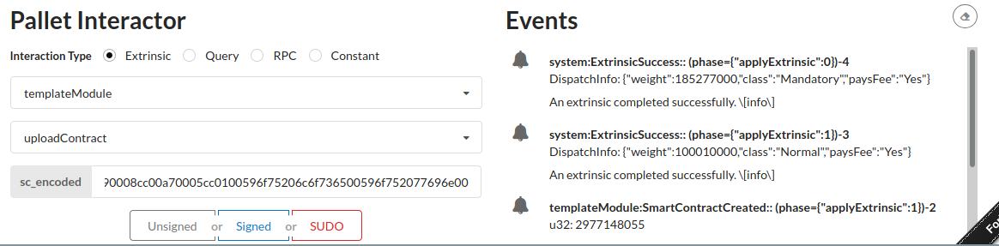
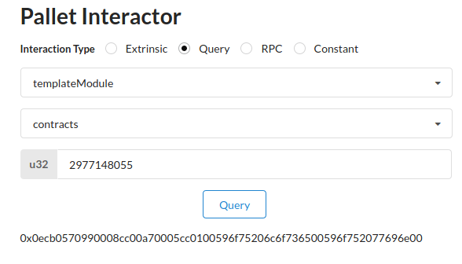
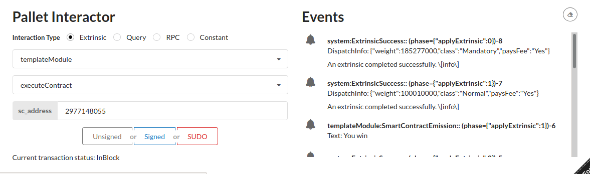

# Assignment 2 report - Olgierd Kasprowicz

## Demo

Smart contract code:
```
0ecb0570990008cc00a70005cc0100596f75206c6f736500596f752077696e00
```





- contract retreival differs from the exact spec as allowed
- the address is unique per contract

## Comments

the VM is implemented as per JVM spec, except:
- arithmetic operations and branch offsets are implemented as unsigned 32-bit integers; though the VM design allows for it to be changed relatively easy. However the task can be accomplished with only unsigend integers and forward jumps.
- the contract header doesn't follow `.class` file structure, mostly since the hear is enormous compare to the actual contract size and it would be wasteful, instead following "file" structure is used:

```
+---------+
|  FILE   |
+---------+
| 1 byte  | -> 8-bit unsigned operation bytecount
+---------+
|         |
|    :    | -> however many bytes indicated above, opcodes for the programme
| n bytes |
|         |
+---------+
|         |
| s bytes | -> arbitrary number (0 or more) of null-terminated strings, which
|         |    will be used as indexed constants (for example by the `emit` insutrction)
+---------+
|  0x00   |
+---------+
|   :     |
|   :     |
+---------+
|         |
|   s'    |
|  bytes  |
|         |
+---------+
|  0x00   |
+---------+
```

Additionally:
- `nop` was implemented to ensure that one of the jumps doesn't happen *outside* of the bytecode (not sure what's the JVMs take on that behaviour, but it's probably frowned upon)
- single contract execution limit could be easily extended from 256 bytes to ~64kb
- technically the `emit` instruction doesn't publish an event to the blockchain - it's done by the environment
- current VM design would make implementing (without emulation) early exit instructions problematic
- bytecode isn't executed directly -> it's first parsed into instruction-oriented (as opposed to bytes-oriented) intermediate representation before interpretation. The ramifications include:
    - rendering direct runtime bytecode manipulation impossible
    - greatly simplifying the executor
    - allowing decouplig from the bytecode
    - complicating the parser a bit -> requiring to pass the programe contents 3 times before it's execution (parsing into intermediate representation, correcting jump offsets, interpretation)

## Implemented bytecode

| Opcode |     Mnemonic    |             Additional arguments            |                                                       Comment                                                      |
|:------:|:---------------:|:-------------------------------------------:|:------------------------------------------------------------------------------------------------------------------:|
|  0x00  |       Nop       |                      -                      |                                       see above for implementation rationale                                       |
|  0x05  |     Iconst2     |                      -                      |                                                                                                                    |
|  0x70  |       Irem      |                      -                      |                                                                                                                    |
|  0x99  |   Ifeq(target)  |                  as per JVM                 |                                                                                                                    |
|  0xa7  |   Goto(target)  |                  as per JVM                 |                                                                                                                    |
|  0xcb  |   Blocknumber   |                      -                      | assignment specific (/ non JVM-compliant); pushes a per-instance defined u32 constant onto the stack (default 123) |
|  0xcc  | Emit(const_idx) | 1 byte - the index of the constant to emmit |                       assignment specific; appends a constant index to the list of VM outputs                      |
|    -   |     Invalid     |                      -                      |             this instruction exists only in the intermediate VM representation to signify any problems             |

## Not-implement functionality
None. All required functionality is implemented fully as per spec unless stated otherwise.

## Appendix
### Formatted bytecode
```
		0x0e,
		0xcb,
		0x05,
		0x70,
		0x99,
		0x00,
		0x08,
		0xcc,
		0x00,
		0xa7,
		0x00,
		0x05,
		0xcc,
		0x01,
		0x00,
			// constants
		0x59,
		0x6f,
		0x75,
		0x20,
		0x6c,
		0x6f,
		0x73,
		0x65,
		0x00,
		0x59,
		0x6f,
		0x75,
		0x20,
		0x77,
		0x69,
		0x6e,
		0x00,
```

### Programme mnemonics (parsed form)
```
		Blocknumber,
		Iconst2,
		Irem,
		Ifeq(6),
		Emit(0),
		Goto(7),
		Emit(1),
		Nop,

        with constants being:
        0. "You lose"
        1. "You win"
```
